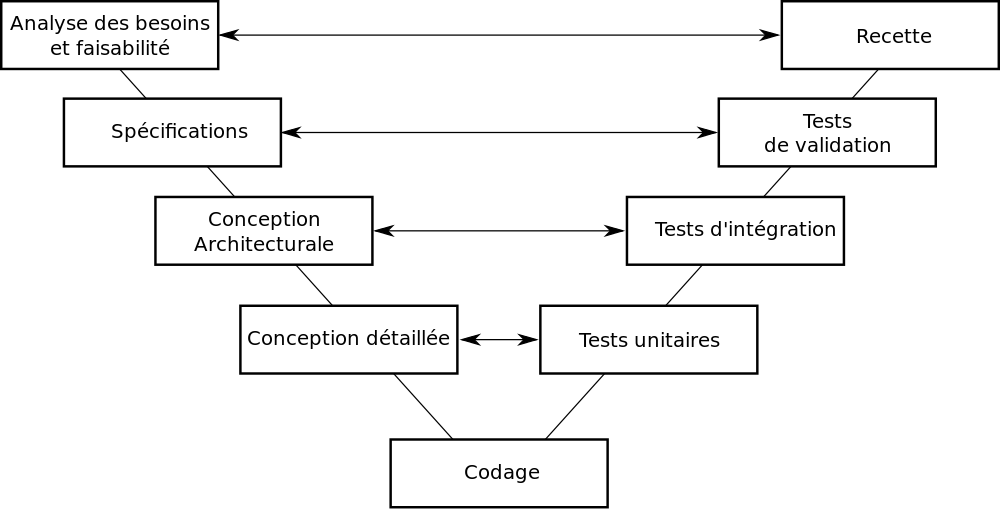
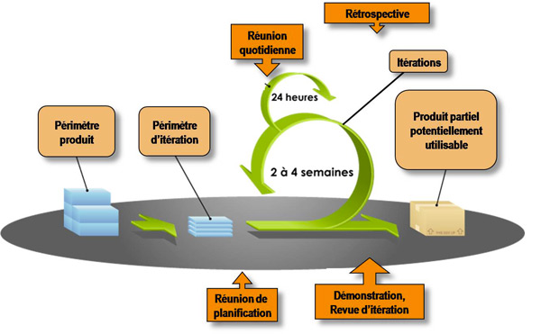

Organisation collaborative du travail
=====================================

Sommaire
--------

### [Introduction](#intro)

### 1. [Les enjeux de la collaboration](#enjeux)

- Intro *Victor*
- Gains de productivité *Victor*
- Collaboration *Nathanaël*
- Entreprise ou projet *Nathanaël*
- Taille de l'entreprise et du projet *Victor*
- Conclu *Victor*

### 2. [Les méthodes de travail](#methodes)

- Introduction *Victor*
- Méthodes de travail dans l'informatique *Nathanaël*
	- Le cycle en V
	- Les méthodes agiles
- Critères de choix *Victor*
	- Rapport avec le client
	- Préférences au sein de l'entreprise
- Conclusion *Nathanaël*
 
### 3. [Les outils d'aide au travail collaboratif](#outils)

- Introduction *Victor*
- ERP *Nathanaël*
- Outils informatiques *Victor*
	- Systèmes de Gestion de Versions
	- Rapport de bugs et gestion des feuilles de route
	- Outils de contrôle de qualité du code
- Conclusion *Victor*

### [Conclusion](#conclu)

Bibliographie
-------------

- Livre Méthodes de W collaboratif
- Livre Méthodes Agiles (à emprunter)
- The Git book

----------------------------------------------------------------------------------------------------

Introduction 
============

*Introduction sur l'organisation collaborative du travail...*

----------------------------------------------------------------------------------------------------

1. Les enjeux de la collaboration 
=================================

Introduction
------------

1.1. Gains de productivité
------------------------

1.2. Collaboration
----------------

Une entreprise a pour objectif de réaliser des produits et services. Mis à part pour les auto-entrepreuneurs, il est donc question de réaliser des projets, quels qu'ils soient, en équipe. De fait, une certaine collaboration entre les membres de cette équipe est inévitable pour parvenir à réaliser le travail attendu.

On peut observer chez certaines espèces animales, notamment les fourmis, la présence d'un très forte collaboration, même si le nombre de participants à un projet est important.

La collaboration définit avant tout le fait que les différents membres du groupe s'entendent pour parvenir à un objectif commun. L'efficacité de cette collaboration est fonction de plusieurs paramètres, tels que la personnalité des différents membres du groupe, les conditions de travail, etc.

L'efficacité est le résultat de la quantité de travail demandé sur le temps qui a été nécessaire pour le réaliser.

Il est important de dissocier l'efficacité de l'équipe et l'efficacité de ses membres. En outre, il faut savoir que l'efficacité de l'équipe n'est pas nécessairement égale à la somme de l'efficacité de ses membres.
TODO: mentionner à ce sujet [Le Mythe du Mois Homme](http://en.wikipedia.org/wiki/The_Mythical_Man-Month)

Ainsi, en terme de performance, la réussite de la collaboration de l'équipe peut être définie par le ratio : efficacité de l'équipe sur la somme de l'efficacité de ses membres.

On peut dès lors observer trois niveaux de collaboration :

- **Faible collaboration** : l'efficacité de l'équipe est inférieure à la somme de l'efficacité de ses membres.
Le groupe est moins performant qu'il le pourrait. Il n'est peut-être pas assez soudé ou certains éléments troublent le travail de l'équipe, ou alors l'organisation et la gestion du travail du groupe n'est pas assez efficace.

- **Bonne collaboration** : l'efficacité de l'équipe est égale à la somme de l'efficacité de ses membres.
Les membres du groupe s'entendent suffisamment bien pour travailler ensemble dans de bonnes conditions. Le groupe peut faire face à certains problèmes qui pourrait perturber le travail, il y a plusieurs interactions positives et la gestion du travail est convenable.

- **Excellente collaboration** : l'efficacité de l'équipe est supérieure à la somme de l'efficacité de ses membres.
Schéma idéal et particulièrement difficile à atteindre, il est toutefois possible d'y parvenir grâce à une équipe particulièrement soudée et organisée. Il est également nécessaire de favoriser l'échange de connaissances entre les différents membres de l'équipe et d'utiliser des outils de travail collaboratif adaptés.

1.3. Entreprise ou projet
-----------------------

L'organisation collaborative du travail concerne d'une part un projet réalisé à plusieurs, mais d'autre part l'entreprise qui réalise un produit ou un service

Il est intéressant de dissocier ces deux aspects, même s'ils sont bien évidement étroitement liés. En effet, on peut retrouver l'usage d'une telle organisation dans certains projets qui ne sont pas réalisés par une entreprise. D'un autre coté, une entreprise peut très bien adopter une certaine organisation, sans toutefois l'appliquer de manière individuelle et personnalisée dans chacun de ses projets.

Le développement d'Internet a grandement facilité le partage d'information entre personnes à travers le monde. Ainsi, certains projets collaboratifs ont pu voir le jour, faisant intervenir différents acteurs géographiquement distants, sans qu'il n'y ait d'entité juridique ni d'établissement physique définis. Dans le cadre de ces projets, qui peuvent faire intervenir des centaines de personnes, une bonne collaboration est indispensable.

1.4. Taille de l'entreprise et du projet
--------------------------------------

Conclusion
----------

*Conclusion de la partie*

----------------------------------------------------------------------------------------------------

2. Les méthodes de travail 
==========================

Introduction
------------

Lorsque un projet devient assez conséquent, sa gestion devient de plus en plus complexe. Un produit informatique comportera un grande quantité de code, dont il faut faciliter la maintenance le plus tôt possible. Il fera intervenir un grand nombre de personnes, réparties dans plusieurs équipes de travail.
En outre, le prestataire devra collaborer avec un client qui n'a pas les mêmes notions techniques et dont les besoins peuvent évoluer.

Une bonne organisation du travail est donc essentielle pour la réussite d'un tel projet.

L'organisation d'un projet passe tout d'abord par une méthode de travail à appliquer. Le choix d'une méthode de travail est généralement la première décision à prendre avec le client avant de commencer le développement d'un produit. En outre, elle aura une grande incidence sur sa réussite.

2.1. Méthodes de travail dans l'informatique
------------------------------------------

Il existe de nombreux modèles de gestion de projet dans le milieu industriel. Nous allons ici nous pencher sur deux méthodes de travail : le cycle en V et les méthodes Agiles.

### 2.1.1 Le cycle en V

En gestion de projet, il est important de considérer les erreurs comme faisant partie intégrante d'un projet (*Erare Humanum est*). Dans l'industrie en général, plus un problème est détecté tôt, plus il sera facile de le corriger et moins grande en seront les conséquences (effets de bord). Ainsi, pendant le développement d'un produit, l'objectif n'est pas tant de limiter les erreurs, mais davantage de parvenir à les détecter le plus tôt possible.

Le cycle en V est un modèle de gestion de projet permettant de limiter ces effets de bord, en découpant la réalisation d'un projet en plusieurs étapes de manière séquentielle.

Le cycle en V est devenu un standard de l'industrie logicielle et dans les autres domaines de l'industrie en général.

Les étapes du cycle en V sont regroupées en plusieurs phases : la phase de conception, la phase de développement et la phase de tests.

On peut noter une correspondances entre les phases d'un même niveau : par exemple, si il existe un problème lors d'un test d'intégration, cela va affecter la conception architecturale.

- La phase de conception :
	- Analyse des besoins et faisabilité ;
	- Spécification ;
	- Conception architecturale ;
	- Conception détaillée.

Les étapes de la phases de conception commencent par une approche très globale du projet, et augmentent progressivement le niveau de détail jusqu'à la phase de codage. Chaque étape de conception s'appuie sur l'étape précédente.

- La phase de développement logiciel (codage)

Il s'agit du développement du produit, qui s'appuie sur la conception détaillée.

- La phase de tests :
	- Tests unitaires ;
	- Tests d'intégration ;
	- Tests de validation ;
	- Recette.

Les tests sont des étapes très importantes dans la réalisation d'un produit, car c'est ce qui permet de valider leur bon fonctionnement et la conformité aux attentes du client. Ils commencent par un niveau de détail élevé, puis offrent une vue de plus en plus globale sur le produit final.

Pour la réalisation d'un projet informatique, ce modèle de gestion de projet à l'avantage de prévoir et de quantifier les besoins, de choisir l'architecture logicielle à adopter, de penser à l'intégration des différentes fonctionnalités, avant de commencer son développement. Cela permet notamment d'anticiper certains problèmes de conception pouvant survenir pendant la phase de codage, et donc de réduire développement de fonctionnalités inadaptées.

Par exemple, dans le cadre de la réalisation d'un site Internet, il sera bien utile aux développeurs de savoir que le site devra proposer plusieurs langages avant de commencer la réalisation. En effet, cette fonctionnalité va influencer l'architecture générale du site, et il sera difficile d'implémenter une telle fonctionnalité en cours de développement si elle n'a pas été prévue au départ.

Ainsi, avec une approche théorique, le cycle en V possède de nombreux avantages et peut se révéler très utile dans le développement d'un projet informatique. Toutefois, la mise en pratique de ce modèle de gestion de projet a mis en valeur certains défauts.

### 2.1.2 Les méthodes agiles

La méthode du cycle en V, bien qu'elle soit intéressante d'un point de vue théorique, possède en réalité de gros inconvénients, pouvant mettre en péril la réussite du projet :

- Les documents de conception sont réalisés par différentes personnes qui ont chacune leur point de vue. Par ailleurs, il n'y a aucun moyen de vérifier la bonne concordance entre ces différents documents. Ainsi, les développeurs peuvent se trouver face à des incohérences considérables dans le dossier de conception.
- Les personnes qui réalisent la conception ont souvent un point de vue trop théorique et n'ont pas forcément en tête les problème techniques qui pourront survenir en utilisant leurs choix de conception.
- La rédaction des différents documents de conception prend du temps et aura donc un impact considérable sur le coût du projet.
- En cas d'arrêt de la production, pour diverses raison, le produit est inutilisable.
- Il est courant que le client change d'avis pendant la réalisation d'un projet. Avec le modèle du cycle en V, un tel changement impactera toutes les étapes de conception, de développement et de tests, ce qui a une forte incidence sur le coût du projet.
- Enfin, le problème le plus important du cycle en V est l'effet dit *Tunnel*. En effet, le client n'a aucune visibilité sur le projet pendant sa réalisation : il est sollicité uniquement au début (pour l'analyse des besoins) et à la fin (pour la recette). Ainsi, si une confusion apparait sur le cahier des charges, le client s'en apercevra uniquement pendant la recette. En prenant également en compte les confusions pouvant exister entre les différentes étapes de conception, le client peut se retrouver face à un produit ne correspondant pas du tout à ses attentes.

Ainsi, l'industrie informatique a parfois connu des scénarios catastrophiques en utilisant la méthode du cycle en V. Dès lors, pour limiter ces dangers, d'autres modèles de gestion de projet ont vu le jour.

Les méthodes agiles, apparues dans les années 1990, sont un groupe de pratiques de développement de projets informatiques reposant sur un même philosophie.
Elles consistent à développer le produit de manière itérative, incrémentale et adaptative. Les fonctionnalités sont développées les unes après les autres, les plus importantes en premier. Le client est sollicité régulièrement afin de vérifier la conformité entre ses attentes avec ce qui a été développé.

En outre, les méthodes agiles permettent :

- une bonne conformité entre les attentes du client et le produit développé ;
- une grande réactivité à ses demandes, même pendant la réalisation du produit ;
- d'obtenir un produit partiellement fonctionnel, quelque soit l'état d'avancement du projet.

Il existe plusieurs méthodes Agiles, qui ont leurs propres spécifications et qui doivent être adaptées en fonction du contexte. Ainsi, il ne suffit pas de choisir de développer un projet au moyen des méthodes agiles, il faut également se pencher sur la méthode à adopter. Parmi les plus connues, on retrouve :

#### La méthode Scrum

Le terme *Scrum* (signifiant « mêlée ») provient du rugby à XV, sport qui a pour objectif d'atteindre un but grace à une équipe soudée.
Le projet est découpé en différentes étapes, appelées *sprints*, comportant un objectif précis à atteindre : un ensemble de fonctionnalités du produit.
Au sein de l'équipe, une personne, désignée *ScrumMaster*, a la charge de former le directeur de produit, l'équipe et l'organisation entière à la méthode Scrum. À la fin de chaque sprint, l'équipe se retrouve pour une réunion appelée *revue de sprint*, pendant laquelle l'équipe valide les fonctionnalités développées et prépare celles du prochain sprint.

Ces fonctionnalités sont souvent représentées physiquement au moyen de *Post-its* à coller sur un tableau composé de trois colonnes correspondant à leur état actuel : *à faire*, *en cours* et *réalisé*.

#### La méthode XP (Extreme programming)

Ma méthode XP consiste en différents principes à appliquer pendant la réalisation d'un projet. Ces derniers existent depuis de nombreuses années, toutefois ils sont ici poussés à l'extrême :

**Citation (_Extreme Programming Explained_) :**
> - puisque la revue de code est une bonne pratique, elle sera faite en permanence (par un binôme)
> - puisque les tests sont utiles, ils seront faits systématiquement avant chaque mise en œuvre
> - puisque la conception est importante, elle sera faite tout au long du projet (refactoring)
> - puisque la simplicité permet d'avancer plus vite, nous choisirons toujours la solution la plus simple
> - puisque la compréhension est importante, nous définirons et ferons évoluer ensemble des métaphores
> - puisque l'intégration des modifications est cruciale, nous l'effectuerons plusieurs fois par jour
> - puisque les besoins évoluent vite, nous ferons des cycles de développement très rapides pour nous adapter au changement

Cette méthodes est adaptée aux équipes réduites avec des besoins qui peuvent évoluer.

2.2. Critères de choix
----------------------

### 2.2.1 Rapport avec le client

### 2.2.2 Préférences au sein de l'entreprise

Conclusion
----------

Nous avons vu les différentes méthodes de travail pouvant être adoptées pour la réalisation d'un projet informatique. Nous avons également vu comment le rapport avec le client et les préférences au sein de l'entreprise peuvent influencer le choix de ces méthodes.

----------------------------------------------------------------------------------------------------

3. Les outils d'aide au travail collaboratif 
============================================

Introduction
------------

Face aux difficultés

3.1. Les progiciel de Gestion Intégré
-------------------------------------

Un Progiciel de Gestion Intégré (PGI ou ERP, de l'anglais *Enterprise Resource Planning*), est une solution logicielle regroupant différents outils ayant pour but d'assister les différentes composantes de l'entreprise. Il permet une gestion globale et simplifiée, via un support organisationnel unique pour toute l'entreprise. L'usage d'une base de données commune facilite grandement la gestion des différents domaines de gestion de l'entreprise.

L'entreprise CXP, spécialisée dans le conseil et l'analyse de solutions logicielles d'entreprise, définit ce progiciel ainsi :

> Un progiciel qui intègre les principales composantes fonctionnelles de l'entreprise : gestion de production, gestion commerciale, logistique, ressources humaines, comptabilité, contrôle de gestion.
> À l'aide de ce système unifié, les utilisateurs de différents métiers travaillent dans un environnement applicatif identique qui repose sur une base de données unique. Ce modèle permet d'assurer l'intégrité des données, la non-redondance de l'information, ainsi que la réduction des temps de traitement.

Il existe des PGI pour de nombreux corps de métiers : l'informatique, la santé, l'éducation, le commerce de détail, etc. D'autre part, ces progiciels sont modulaires et permettent d'activer uniquement les fonctionnalités nécessaires, ils sont également hautement paramétrables. Ainsi, un PGI pourra s'adapter afin de correspondre exactement aux besoins de l'entreprise. Le paramétrage d'un tel progiciel peut donc se révéler complexe, aussi certaines entreprises préfèrent sous-traiter l'installation du PGI.

On peut notamment retrouver dans la base de données d'un PGI :

- Une table pour les produits, comportant leurs nomenclatures, leurs matières premières, leurs quantités, etc. ;
- Une table pour les clients, comportant leurs commandes et livraisons ;
- Des tables pour les stocks, les durées de conservations, les délais d'acheminement des transporteurs ;
- Des tables relatives aux aspects financiers de l'entreprise.

On remarque qu'à travers une unique base de données, plusieurs domaines rentrent en jeu : la table des produits comporte à la fois les nomenclatures et matières premières, qui sont des informations relatives à la fabrication, mais également la quantité, qui est une information relative à la vente.

3.2. Outils informatiques
-------------------------

Le développement informatique en équipe pose de nombreuses difficultés spécifiques, en plus de celles qui sont commune à toute forme de collaboration. Afin de faire face à ces difficultés, de nombreux outils spécifiques ont été créés. Certains de ces outils sont largement utilisés en entreprises.

### 3.2.1 Systèmes de Gestion de Versions

Parmi les premiers problèmes à émerger dès que plusieurs développeurs travaillent sur un même logiciel est le partage des modifications. Cela regroupe plusieurs problèmes :

- Chacun doit disposer de la dernière version du logiciel, afin de ne pas baser ses modifications sur quelque chose qui n’est plus d’actualité.
- Si plusieurs personnes apportent des modifications différentes à leur copies respectives d’un même fichier, plus personne ne dispose d’une version incluant toutes les dernières modifications. Pour cela, il est nécessaire de créer une version fusionnant ces modifications.
- Parfois, plusieurs versions d’un même logiciel doivent coexister (par exemple, une version stable à laquelle ne sont apportées que des corrections de bugs, et une version proposant de nouvelles fonctionnalités expérimentales). Cela peut rapidement devenir source de confusion.
- Suite à la découverte d’une régression (apparition d’un bug qui n’existait pas précédemment), il est important de déterminer exactement quelle modification a entraîné ce bug afin de pouvoir le corriger au plus vite.

Les outils de contrôle de version permettent de répondre à ces problèmes. Parmi ces logiciels, les deux qui sont le plus couramment utilisés sont SVN et Git. Bien que leur fonctionnements internes soient fondamentalement différents, ils offrent des fonctionnalité similaires :

- Regroupement d’un ensemble de modifications en unités atomiques (baptisées « révisions » par SVN et « commits » par Git)
- Publication de ces modifications
- Accès aux informations utile concernant chaque modification (auteur, date, différences ligne à ligne)
- Fusionnement (« merge ») automatique des modifications à un même fichier, lorsque c’est possible
- Création de « branches », permettant d’isoler plusieurs versions divergentes
- Possibilité de retourner à n’importe quel état antérieur

Ces fonctionnalités permettent de répondre aux problèmes formulés ci-dessus.

### 3.2.2 Rapport de bugs et gestion des feuilles de route

Un logiciel est destiné à évoluer constamment. De nouveaux bugs sont découverts, et le client demande de nouvelles fonctionnalités. Une gestion de projet efficace nécessite d’identifier ces différentes tâches (qu’il s’agisse de corrections ou d’évolutions), d’en estimer le coût et d’y affecter des ressources humaines et matérielles. Il existe des outils prévus à cet effet, tels que Trac ou Redmine.

Ces outils associe à chaque tâche un « ticket ». Chaque ticket peut être affecter à une ou plusieurs personnes, ce qui permet au chef de projet de suivre l’avancement global du projet ainsi que la répartition des tâches *via* une interface Web.

Lorsque cela est souhaité, ces outils permettent à des personnes extérieures au projet de créer de nouveau tickets. Cette pratique est largement répandue dans les projets open-source, mais elle est également utilisée par certaines entreprises afin d’offrir au client un cadre formel pour effectuer des demandes.

De plus, ces outils offrent une intégration avec les systèmes de gestion de versions. Il est par exemple possible d’afficher la liste des modifications se rapportant à un ticket donné, ou d’imposer des restrictions sur les modifications autorisées (par exemple, interdire à un développeur de publier des modifications relatives à un ticket auquel il n’est pas affecté).

### 3.2.3 Outils de contrôle de qualité du code

Tout développeur est capable d’écrire du code compréhensible pour l’ordinateur. Faire en sorte que ce code soit également compréhensible par les autres développeurs participant au projet est non moins important, mais peut s’avérer plus difficile. En effet, chacun a son propre style et ses idiosyncrasies auxquelles les autres ne sont pas habitués.

C’est pourquoi il existe des *conventions de code* — des ensembles de règles de programmation. Certaines sont des standards internationaux, d’autres des règles internes à une entreprise. Lorsque tous les participants à un projet comprennent et respectent les mêmes conventions de code, la compréhension mutuelle est grandement facilitée, ce qui à son tour facilite la collaboration.

Ces conventions ne sont utiles que si elles sont appliquées, et vérifier cela manuellement serait laborieux. Heureusement, il existe des outils informatiques permettant de vérifier automatiquement le respect des conventions. Ces outils d’analyse du code ont généralement d’autres fonctionnalités, comme la détection d’erreurs de programmation potentielles.

Une fois mis en place, ces outils permettent de détecter et de corriger au plus vite certains problèmes.

Conclusion
----------

Ainsi, il existe de nombreux outils informatiques permettant de faciliter la collaboration. Cependant, aussi sophistiqués que soient ces outils, ils ne font pas tout. Le facteur humain reste primordial, et une bonne entente est nécessaire afin d’atteindre une synergie efficace entre les participants.

Conclusion 
==========

*Conclusion du dossier*
